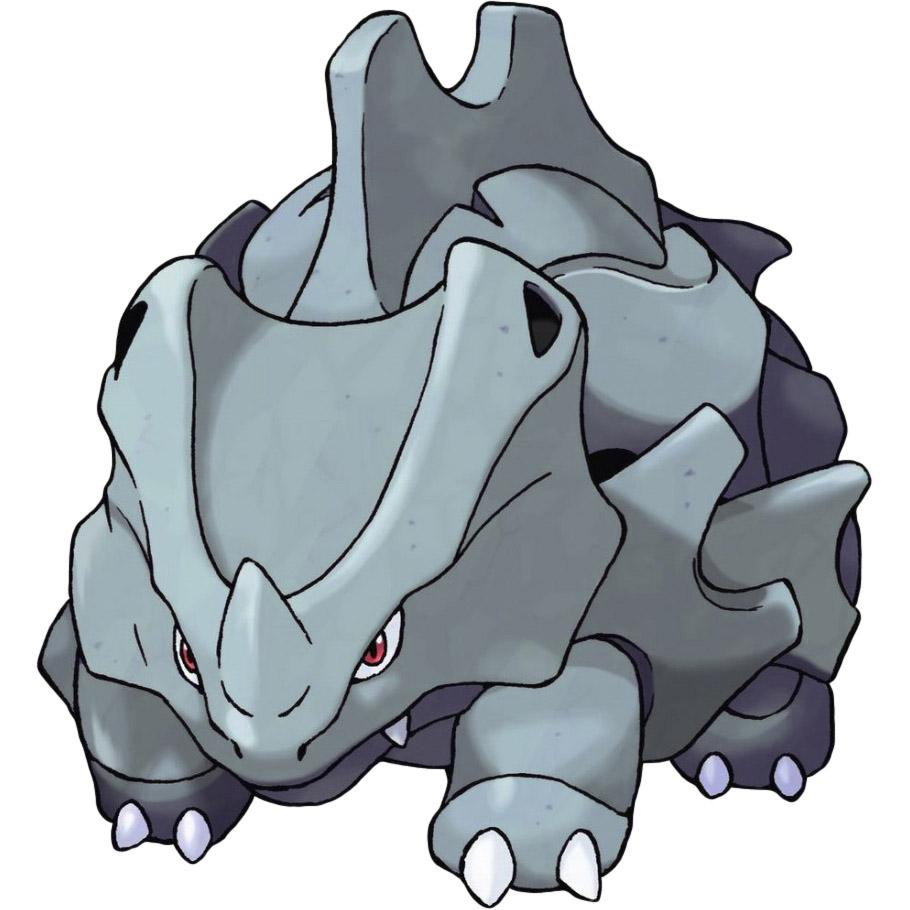
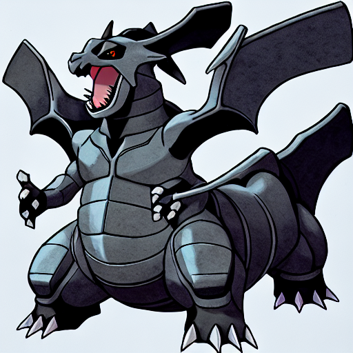
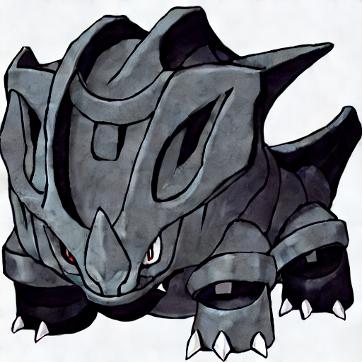

<!---
Copyright 2020 The HuggingFace Team. All rights reserved.

Licensed under the Apache License, Version 2.0 (the "License");
you may not use this file except in compliance with the License.
You may obtain a copy of the License at

    http://www.apache.org/licenses/LICENSE-2.0

Unless required by applicable law or agreed to in writing, software
distributed under the License is distributed on an "AS IS" BASIS,
WITHOUT WARRANTIES OR CONDITIONS OF ANY KIND, either express or implied.
See the License for the specific language governing permissions and
limitations under the License.
-->

# Stable Diffusion

The script [`run_diffusion.py`](https://github.com/huggingface/optimum-intel/blob/main/examples/neural_compressor/text-to-image/run_diffusion.py)
allows us to apply different quantization approaches (such as dynamic, static) using the [Intel Neural Compressor ](https://github.com/intel/neural-compressor) library for 
text to image tasks.

The following example applies post-training static quantization on a stable-diffusion with pretrained model:[lambdalabs/sd-pokemon-diffusers](https://huggingface.co/lambdalabs/sd-pokemon-diffusers). In this example, we only quantize the unet model which is the performance critical in the diffusion pipeline, and the diffusion pipeline has four models: safety_checker, text_encoder, unet, vae. 

## Prepare 
### pretrained model
```bash
git lfs install
git clone https://huggingface.co/lambdalabs/sd-pokemon-diffusers
```
Now, the models are in sd-pokemon-diffusers

### Ground Truth Images
In this case, we used FID metric to evaluate the model, so we should download [training datasets](https://huggingface.co/datasets/lambdalabs/pokemon-blip-captions) and choose one image to a directory(like "base_images").
>**Note:** In this case we used picture: [Ground_Truth_Image](https://datasets-server.huggingface.co/assets/lambdalabs/pokemon-blip-captions/--/lambdalabs--pokemon-blip-captions/train/14/image/image.jpg).

## Quantization
```bash
python run_diffusion.py \
    --model_name_or_path stable-diffusion-v1-4 \
    --apply_quantization \
    --quantization_approach static \
    --tolerance_criterion 0.02 \
    --verify_loading \
    --output_dir /tmp/diffusion_output \
    --base_images base_images \   # The path of the ground truth pictures
    --input_text "a drawing of a gray and black dragon" \
    --calib_text "a drawing of a green pokemon with red eyes" # The prompt to calibrate for static quantization
```

In order to apply dynamic or static, `quantization_approach` must be set to respectively `dynamic` or `static`.

The configuration file containing all the information related to the model quantization can be 
specified using respectively `quantization_config`. If not specified, the default
[quantization](https://github.com/huggingface/optimum-intel/blob/main/examples/neural_compressor/text-to-image/quantization.yml),
configuration files will be used.

The flag `--verify_loading` can be passed along to verify that the resulting quantized model can be loaded correctly.

The ground truth image:


The image generated by original model(FID with ground truth: 333):


The image generated by quantized UNet(FID with ground truth: 246):


## Performance
Original model
```bash
python run_diffusion.py \
    --output_dir /tmp/diffusion_output \
    --base_images base_images \   # The path of the ground truth pictures
    --input_text "a drawing of a gray and black dragon" \
    --benchmark
```
The model of quantized UNet
```bash
python run_diffusion.py \
    --output_dir /tmp/diffusion_output \
    --base_images base_images \   # The path of the ground truth pictures
    --input_text "a drawing of a gray and black dragon" \
    --benchmark \
    --int8
```
>**Nonte:** The performance of quantized model will get 2.56X speedup in Intel(R) Xeon(R) Platinum 8375C CPU @ 2.90GHz with Tcmalloc and IOMP. The Tcmalloc and IOMP usage are in [Performance Tuning Guide](https://intel.github.io/intel-extension-for-pytorch/cpu/latest/tutorials/performance_tuning/tuning_guide.html)
